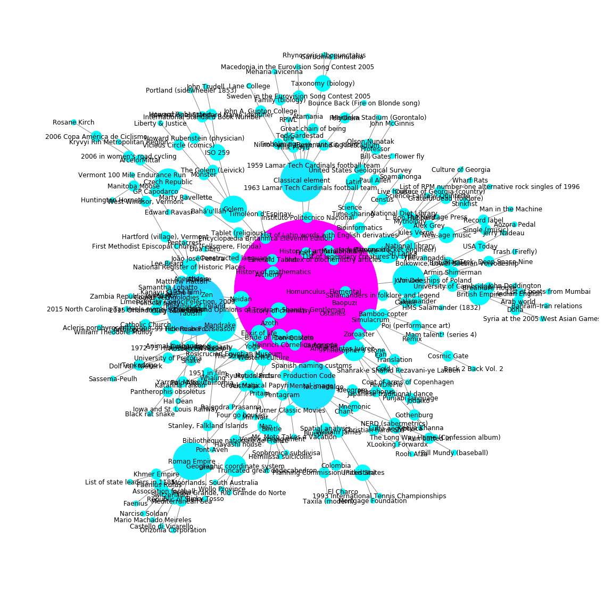

# How Many Clicks Away from the Homunculus?

```python
import json
import networkx as nx
import matplotlib.pyplot as plt
plt.rc('figure', figsize=(15, 15))

from jsoncache import printf

with open("datasets/random100.json") as hist:
    data = json.load(hist)

paths = {d["start"]: min(d["paths"], key=len) for d in data.values()}
pL = [len(p) - 1 for p in paths.values()]


graph_map = []
for key, vals in paths.items():
    for i, v in enumerate(vals):
        if i < len(vals) -1:
            graph_map += [(vals[i], vals[i+1])]


printf("Avg: %.2f", sum(pL) / len(pL))
printf("Max: %d, Min: %d", max(pL), min(pL))
```

    Avg: 3.94
    Max: 5, Min: 3


```python
def plot_graph(graph_map):
    G = nx.Graph()
    G.add_edges_from(sorted(graph_map))
    d = nx.degree(G)
    ds = list(zip(*d))
    # print(ds)
    pos = nx.spring_layout(G)
    colors = range(G.number_of_edges())
    colors2 = [d * d for d in ds[1]]
    nx.draw(G, pos,
            edge_color="#848484",
            node_list=ds[0],
            node_size=[d * d * 100 for d in ds[1]],
            node_color=colors2,
            width=1, cmap=plt.cm.cool, with_labels=True)
    plt.show()

plot_graph(graph_map)
```





```python
with open("datasets/top50.json") as hist:
    top_data = json.load(hist)


top_pL = []
for node, values in top_data.items():
    path = values["paths"][0]
    top_pL.append(len(path) - 1)
    print("(%d) %s" % (len(path) -1, " -> ".join(path)))
    print("."*40)
```

    (3) Australia -> Western culture -> History of chemistry -> Homunculus
    ........................................
    (4) Eminem -> The Recovery Tour -> Republic of Ireland -> The Life and Opinions of Tristram Shandy, Gentleman -> Homunculus
    ........................................
    (4) Kim Kardashian -> 90210 (TV series) -> Republic of Ireland -> The Life and Opinions of Tristram Shandy, Gentleman -> Homunculus
    ........................................
    (3) Earth -> Phaeton (hypothetical planet) -> Superseded scientific theories -> Homunculus
    ........................................
    (3) Albert Einstein -> Matter -> Classical element -> Homunculus
    ........................................
    (4) Game of Thrones -> Valyrian languages -> Latin -> List of Latin words with English derivatives -> Homunculus
    ........................................
    (3) United Kingdom -> University College London -> Raymond Briggs -> Homunculus
    ........................................
    (3) Harry Potter -> Wicca -> Classical element -> Homunculus
    ........................................
    (4) Academy Awards -> Virginia Film Office -> National Film Registry -> Bride of Frankenstein -> Homunculus
    ........................................
    (3) Miley Cyrus -> Guardians of the Galaxy Vol. 2 -> Fractal -> Homunculus
    ........................................
    (3) Japan -> Tang dynasty -> Elixir of life -> Homunculus
    ........................................
    (4) Rihanna -> The Guardian -> The Guardian's 100 Best Novels Written in English -> The Life and Opinions of Tristram Shandy, Gentleman -> Homunculus
    ........................................
    (3) Star Wars -> Psychokinesis -> Alchemy -> Homunculus
    ........................................
    (4) Kanye West -> Richard Blumenthal -> University of Cambridge -> John Dee -> Homunculus
    ........................................
    (4) Lady Gaga -> The Telltale Moozadell -> Denial, Anger, Acceptance -> Golem -> Homunculus
    ........................................
    (3) Glee (TV series) -> Plagiarism -> Simulacrum -> Homunculus
    ........................................
    (3) Michael Jackson -> National Film Registry -> Bride of Frankenstein -> Homunculus
    ........................................
    (4) Mark Zuckerberg -> Virtual International Authority File -> Czech Republic -> Golem -> Homunculus
    ........................................
    (4) Lil Wayne -> USA Today -> British Isles -> John Dee -> Homunculus
    ........................................
    (3) The Beatles -> Transcendental Meditation -> Mental image -> Homunculus
    ........................................
    (4) Cristiano Ronaldo -> Stoke City F.C. -> Republic of Ireland -> The Life and Opinions of Tristram Shandy, Gentleman -> Homunculus
    ........................................
    (4) New York City -> Stadium -> Latin -> List of Latin words with English derivatives -> Homunculus
    ........................................
    (3) The Walking Dead (TV series) -> The Librarian: Curse of the Judas Chalice -> Philosopher's stone -> Homunculus
    ........................................
    (3) Stephen Hawking -> University of Cambridge -> John Dee -> Homunculus
    ........................................
    (4) Russia -> Siberia -> Sheep -> Mandrake -> Homunculus
    ........................................
    (2) Sex -> Sperm -> Homunculus
    ........................................
    (3) How I Met Your Mother -> Unreliable narrator -> The Life and Opinions of Tristram Shandy, Gentleman -> Homunculus
    ........................................
    (3) Elizabeth II -> Monarchy of Saint Vincent and the Grenadines -> Heredity -> Homunculus
    ........................................
    (3) United States -> Western culture -> History of chemistry -> Homunculus
    ........................................
    (4) Barack Obama -> Space Shuttle Challenger disaster -> Glass transition -> Elemental -> Homunculus
    ........................................
    (4) France -> World War I casualties -> Republic of Ireland -> The Life and Opinions of Tristram Shandy, Gentleman -> Homunculus
    ........................................
    (3) Steve Jobs -> Zen -> Neidan -> Homunculus
    ........................................
    (4) Taylor Swift -> Taylor Lautner -> Werewolf -> Mandrake -> Homunculus
    ........................................
    (5) Tupac Shakur -> Yo! MTV Raps -> Alternative rock -> Zine -> Simulacrum -> Homunculus
    ........................................
    (4) Abraham Lincoln -> Presidency of Gerald Ford -> Pandemic -> History of chemistry -> Homunculus
    ........................................
    (4) Canada -> Welfare state -> Czech Republic -> Golem -> Homunculus
    ........................................
    (4) World War II -> Plenipotentiary -> Latin -> List of Latin words with English derivatives -> Homunculus
    ........................................
    (3) Selena Gomez -> Hotel Transylvania (franchise) -> Frankenstein -> Homunculus
    ........................................
    (3) Johnny Depp -> The Invisible Man (film) -> Bride of Frankenstein -> Homunculus
    ........................................
    (4) Germany -> Research and development -> Fictional technology -> Golem -> Homunculus
    ........................................
    (4) Donald Trump -> USA Today -> British Isles -> John Dee -> Homunculus
    ........................................
    (3) Justin Bieber -> Androgyny -> Alchemy -> Homunculus
    ........................................
    (3) Breaking Bad -> Yoga -> Mental image -> Homunculus
    ........................................
    (3) China -> Taoism -> Neidan -> Homunculus
    ........................................
    (3) The Big Bang Theory -> The Lord of the Rings -> Elemental -> Homunculus
    ........................................
    (4) World War I -> Togoland -> British Empire -> John Dee -> Homunculus
    ........................................
    (3) Adolf Hitler -> Parkinson's disease -> Heredity -> Homunculus
    ........................................
    (3) India -> Yoga -> Mental image -> Homunculus
    ........................................
    (4) Lionel Messi -> Treble (association football) -> Republic of Ireland -> The Life and Opinions of Tristram Shandy, Gentleman -> Homunculus
    ........................................
    (4) List of Presidents of the United States -> United States presidential election, 1940 -> New Age -> Jack Parsons (rocket engineer) -> Homunculus
    ........................................


```python
printf("Avg: %.2f", sum(top_pL) / len(top_pL))
printf("Max: %d, Min: %d", max(top_pL), min(top_pL))
```

    Avg: 3.48
    Max: 5, Min: 2


## Path Max Error margin.

Because of the way the bidrectional search works, the algorithm used will not necessarily return the shortest path from A to b.

$$
\begin{equation}
  f(x)=\begin{cases}
    0, & \text{if $x<4$}\\
    \lceil \frac{x}{2} \rceil - 1\\
  \end{cases}
\end{equation}
$$


```python
depth = [0, 1, 2, 3, 4, 5, 6, 7, 8, 9, 10, 11, 12]
min_d = [0, 1, 2, 3, 3, 3, 4, 4, 5, 5, 6,  6,  7]
err   = [0, 0, 0, 0, 1, 2, 2, 3, 3, 4, 4,  5,  5]


errFn = lambda x: ((x + 1) >> 1) - 1 if x > 3 else 0

def err_fn(x):
    if x > 3:
        return (x + 1) // 2 - 1
    else:
        return 0


def test_err_fn():
    e = False
    for i, d in enumerate(depth):
        try:
            assert err_fn(d) == errFn(d)
            assert err[i] == errFn(d)
        except:
            e = True
            printf("Error: fn(%d) == %.2f, got1=%.2f, got2=%.2f",
                   d, err[i], errFn(d), err_fn(d))
    if not e:
        print("all tests pass")

test_err_fn()
```

    all tests pass

