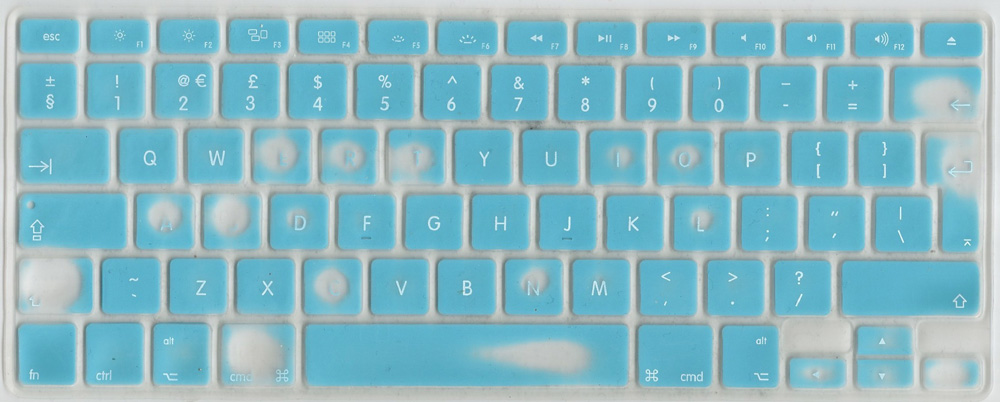

# Tired Keyboard

Collecting data from my tired keyboard matt to learn about its use in relation to language and interfacing with programs.

Most of the data in this folder is generated by me and is free to use.

`unigrams.csv` dataset has come from the [google Ngram Viewer](http://storage.googleapis.com/books/ngrams/books/datasetsv2.html) and is licensed under a [Creative Commons Attribution 3.0 Unported License](https://creativecommons.org/licenses/by/3.0/).